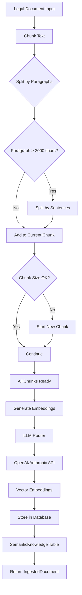

## Overview

The `IngestLegalDocumentUseCase` processes legal documents (legislation, jurisprudence, legal doctrine) and stores them in the semantic knowledge base with embeddings for AI-powered retrieval. This enables the chatbot to provide accurate legal information grounded in official sources.

**Source**: `backend/src/application/use_cases/ingest_legal_document.py`

## Class Structure

### Main Class

```python
class IngestLegalDocumentUseCase:
    """
    Ingesta documentos legales en la base de conocimiento.
    
    Proceso:
    1. Divide el contenido en chunks de tamaño adecuado
    2. Genera embeddings para cada chunk
    3. Almacena en la base de datos con metadata
    """
```

Defined at: `ingest_legal_document.py:26-34`

### Dependencies

```python
def __init__(self, db: Session):
    self.db = db
    self.llm = LLMRouter()
    self.max_chunk_size = 500  # tokens aproximados
```

Defined at: `ingest_legal_document.py:36-39`

**Dependencies:**
- `db`: SQLAlchemy session for database operations
- `llm`: LLM router for generating embeddings via OpenAI/Anthropic
- `max_chunk_size`: Maximum chunk size in tokens (~2000 characters)

## Data Transfer Objects (DTOs)

### IngestedDocument

Output DTO reporting ingestion results:

```python
@dataclass
class IngestedDocument:
    """Resultado de la ingestión de un documento"""
    title: str
    chunks_created: int
    success: bool
```

Defined at: `ingest_legal_document.py:18-23`

**Fields:**
- `title`: Document title
- `chunks_created`: Number of chunks successfully created
- `success`: Whether ingestion succeeded

## Document Ingestion Flow

### Process Diagram



## Main Execution Method

### execute()

The main ingestion method:

```python
async def execute(self, title: str, content: str, category: str = "legislacion") -> IngestedDocument:
    """
    Ingesta un documento legal.
    
    Args:
        title: Título del documento
        content: Contenido completo del documento
        category: Categoría (legislacion, jurisprudencia, doctrina)
    
    Returns:
        IngestedDocument con resultado de la operación
    """
    try:
        logger.info("ingest_document_started", title=title, category=category)
        
        # 1. Dividir en chunks
        chunks = self._chunk_text(content)
        logger.info("document_chunked", chunks=len(chunks))
        
        # 2. Generar embeddings
        embeddings = await self.llm.embed(chunks)
        logger.info("embeddings_generated", count=len(embeddings))
        
        # 3. Almacenar en la base de datos
        chunks_created = 0
        for i, (chunk, embedding) in enumerate(zip(chunks, embeddings)):
            knowledge = SemanticKnowledge(
                title=f"{title} - Parte {i+1}/{len(chunks)}",
                content=chunk,
                embedding=embedding
            )
            self.db.add(knowledge)
            chunks_created += 1
        
        self.db.commit()
        
        logger.info(
            "ingest_document_completed",
            title=title,
            chunks=chunks_created
        )
        
        return IngestedDocument(
            title=title,
            chunks_created=chunks_created,
            success=True
        )
        
    except Exception as e:
        self.db.rollback()
        logger.error("ingest_document_failed", title=title, error=str(e))
        return IngestedDocument(
            title=title,
            chunks_created=0,
            success=False
        )
```

Defined at: `ingest_legal_document.py:41-96`

<Info>
The method is **async** because it calls the LLM API for embedding generation, which is an I/O-bound operation.
</Info>

## Text Chunking Strategy

### _chunk_text()

Intelligent text splitting that preserves semantic meaning:

```python
def _chunk_text(self, text: str) -> List[str]:
    """
    Divide el texto en chunks manejables.
    
    Estrategia:
    - Divide por párrafos primero
    - Si un párrafo es muy largo, lo divide por oraciones
    - Mantiene tamaño máximo de ~500 tokens (aprox 2000 caracteres)
    """
    chunks = []
    paragraphs = text.split('\n\n')
    
    current_chunk = ""
    max_chars = 2000  # Aproximadamente 500 tokens
    
    for paragraph in paragraphs:
        paragraph = paragraph.strip()
        if not paragraph:
            continue
        
        # Si el párrafo es muy largo, dividirlo
        if len(paragraph) > max_chars:
            # Dividir por oraciones
            sentences = paragraph.replace('. ', '.|').split('|')
            for sentence in sentences:
                if len(current_chunk) + len(sentence) > max_chars:
                    if current_chunk:
                        chunks.append(current_chunk.strip())
                    current_chunk = sentence
                else:
                    current_chunk += " " + sentence
        else:
            # Si agregar este párrafo excede el límite, guardar el chunk actual
            if len(current_chunk) + len(paragraph) > max_chars:
                if current_chunk:
                    chunks.append(current_chunk.strip())
                current_chunk = paragraph
            else:
                current_chunk += "\n\n" + paragraph
    
    # Agregar el último chunk
    if current_chunk:
        chunks.append(current_chunk.strip())
    
    return chunks
```

Defined at: `ingest_legal_document.py:98-142`

### Chunking Strategy

<Steps>
  <Step title="Split by Paragraphs">
    Text is first divided at double newlines (`\n\n`) to preserve paragraph structure
  </Step>
  <Step title="Check Paragraph Length">
    If a paragraph exceeds 2000 characters, it's split by sentences
  </Step>
  <Step title="Sentence Splitting">
    Uses period-space pattern (`. `) to identify sentence boundaries
  </Step>
  <Step title="Accumulate Chunks">
    Text is accumulated until it approaches the 2000 character limit
  </Step>
  <Step title="Finalize">
    Remaining text becomes the final chunk
  </Step>
</Steps>

<Warning>
**Why 2000 characters?**

This approximates **500 tokens**, which is optimal for:
- Embedding model context windows (most handle 512-8192 tokens)
- Retrieval relevance (smaller chunks = more precise matching)
- Cost efficiency (fewer tokens per embedding)
</Warning>

## Embedding Generation

### LLM Router Integration

Embeddings are generated via the LLM router:

```python
# 2. Generar embeddings
embeddings = await self.llm.embed(chunks)
logger.info("embeddings_generated", count=len(embeddings))
```

Defined at: `ingest_legal_document.py:61-62`

The `LLMRouter.embed()` method:
- Batches multiple chunks for efficiency
- Uses OpenAI's `text-embedding-3-large` or similar
- Returns list of embedding vectors (1536 dimensions for OpenAI)

### Embedding Vector Format

Example vector structure:

```python
[
  0.0234, -0.0456, 0.0789, ..., 0.0123  # 1536 dimensions
]
```

These vectors enable **semantic similarity search** using cosine similarity or vector database queries.

## Database Storage

### SemanticKnowledge Model

Chunks are stored in the `semantic_knowledge` table:

```python
for i, (chunk, embedding) in enumerate(zip(chunks, embeddings)):
    knowledge = SemanticKnowledge(
        title=f"{title} - Parte {i+1}/{len(chunks)}",
        content=chunk,
        embedding=embedding
    )
    self.db.add(knowledge)
    chunks_created += 1

self.db.commit()
```

Defined at: `ingest_legal_document.py:66-75`

**Database Schema:**

| Column | Type | Description |
|--------|------|-------------|
| `id` | Integer | Primary key |
| `title` | String | Chunk title (includes part number) |
| `content` | Text | Chunk content |
| `embedding` | Vector | Embedding vector (pgvector type) |
| `created_at` | DateTime | Timestamp |
| `category` | String | Document category |

<Note>
The platform uses **PostgreSQL with pgvector extension** to store and query embedding vectors efficiently.
</Note>

## Error Handling

### Transaction Rollback

```python
except Exception as e:
    self.db.rollback()
    logger.error("ingest_document_failed", title=title, error=str(e))
    return IngestedDocument(
        title=title,
        chunks_created=0,
        success=False
    )
```

Defined at: `ingest_legal_document.py:89-96`

**Error Scenarios:**
- API failures (OpenAI/Anthropic down)
- Database connection issues
- Invalid input format
- Memory errors (very large documents)

All errors result in:
- Database transaction rollback
- Structured error logging
- `success=False` response

## Real Usage Examples

### Example 1: Ingest Legislation

```python
from sqlalchemy.orm import Session
from application.use_cases.ingest_legal_document import IngestLegalDocumentUseCase

async def ingest_civil_code(db: Session):
    """
    Ingest the Argentine Civil Code
    """
    use_case = IngestLegalDocumentUseCase(db)
    
    # Read document from file
    with open("data/codigo_civil.txt", "r", encoding="utf-8") as f:
        content = f.read()
    
    # Ingest
    result = await use_case.execute(
        title="Código Civil y Comercial de Argentina",
        content=content,
        category="legislacion"
    )
    
    if result.success:
        print(f"✅ Ingested {result.chunks_created} chunks")
    else:
        print(f"❌ Ingestion failed for {result.title}")

# Result:
# ✅ Ingested 342 chunks
```

### Example 2: Batch Ingestion

```python
import asyncio
from pathlib import Path

async def ingest_all_documents(db: Session):
    """
    Ingest all legal documents from a directory
    """
    use_case = IngestLegalDocumentUseCase(db)
    docs_dir = Path("data/legal_docs")
    
    results = []
    for doc_file in docs_dir.glob("*.txt"):
        with open(doc_file, "r", encoding="utf-8") as f:
            content = f.read()
        
        result = await use_case.execute(
            title=doc_file.stem,  # Filename without extension
            content=content,
            category="legislacion"
        )
        results.append(result)
    
    # Summary
    total_chunks = sum(r.chunks_created for r in results)
    successful = sum(1 for r in results if r.success)
    
    print(f"📚 Ingested {successful}/{len(results)} documents")
    print(f"📊 Total chunks: {total_chunks}")

# Result:
# 📚 Ingested 15/15 documents
# 📊 Total chunks: 1,247
```

### Example 3: API Endpoint

```python
from fastapi import APIRouter, UploadFile, File, Depends
from sqlalchemy.orm import Session
from application.use_cases.ingest_legal_document import (
    IngestLegalDocumentUseCase,
    IngestedDocument
)

router = APIRouter(prefix="/admin", tags=["admin"])

@router.post("/ingest-document", response_model=IngestedDocument)
async def ingest_document(
    file: UploadFile = File(...),
    title: str = None,
    category: str = "legislacion",
    db: Session = Depends(get_db),
    current_user: dict = Depends(require_admin_role)
):
    """
    Ingest a legal document from file upload.
    
    Requires admin role.
    """
    # Read file content
    content = (await file.read()).decode("utf-8")
    
    # Use filename as title if not provided
    doc_title = title or file.filename
    
    # Ingest
    use_case = IngestLegalDocumentUseCase(db)
    result = await use_case.execute(doc_title, content, category)
    
    return result
```

**Request:**
```bash
curl -X POST "http://api.defensoria.gob.ar/admin/ingest-document" \
  -H "Authorization: Bearer <admin_token>" \
  -F "file=@codigo_civil.txt" \
  -F "title=Código Civil y Comercial" \
  -F "category=legislacion"
```

**Response:**
```json
{
  "title": "Código Civil y Comercial",
  "chunks_created": 342,
  "success": true
}
```

## Document Categories

The platform supports three document categories:

<CardGroup cols={3}>
  <Card title="Legislación" icon="scale-balanced">
    Laws, codes, regulations
    
    Examples:
    - Código Civil y Comercial
    - Ley de Matrimonio Civil
    - Código Procesal Civil
  </Card>
  <Card title="Jurisprudencia" icon="gavel">
    Court decisions, precedents
    
    Examples:
    - Supreme Court rulings
    - Provincial court decisions
    - Case law interpretations
  </Card>
  <Card title="Doctrina" icon="book-open">
    Legal scholarship, commentary
    
    Examples:
    - Academic papers
    - Legal textbooks
    - Expert opinions
  </Card>
</CardGroup>

## Semantic Search Usage

### Querying Ingested Documents

Once documents are ingested, they can be queried using semantic search:

```python
from infrastructure.ai.router import LLMRouter
from infrastructure.persistence.models import SemanticKnowledge

async def search_legal_knowledge(query: str, db: Session, limit: int = 5):
    """
    Search legal knowledge base using semantic similarity
    """
    llm = LLMRouter()
    
    # 1. Generate query embedding
    query_embedding = await llm.embed([query])
    query_vector = query_embedding[0]
    
    # 2. Find similar chunks using pgvector
    results = db.query(SemanticKnowledge).order_by(
        SemanticKnowledge.embedding.cosine_distance(query_vector)
    ).limit(limit).all()
    
    return [
        {
            "title": r.title,
            "content": r.content,
            "similarity": 1 - r.embedding.cosine_distance(query_vector)
        }
        for r in results
    ]

# Example usage:
results = await search_legal_knowledge(
    "¿Cuáles son los requisitos para el divorcio?",
    db
)

# Results:
# [
#   {
#     "title": "Código Civil y Comercial - Parte 12/342",
#     "content": "Artículo 435. Divorcio. El divorcio se decreta...",
#     "similarity": 0.89
#   },
#   ...
# ]
```

## Performance Considerations

### Optimization Tips

<AccordionGroup>
  <Accordion title="Batch Embedding Generation">
    Generate embeddings for multiple chunks in a single API call:
    
    ```python
    # Good: Single API call
    embeddings = await self.llm.embed(chunks)  # All chunks at once
    
    # Bad: Multiple API calls
    for chunk in chunks:
        embedding = await self.llm.embed([chunk])  # N API calls
    ```
  </Accordion>
  
  <Accordion title="Database Indexing">
    Ensure pgvector indexes are created:
    
    ```sql
    CREATE INDEX idx_semantic_knowledge_embedding 
    ON semantic_knowledge 
    USING ivfflat (embedding vector_cosine_ops)
    WITH (lists = 100);
    ```
  </Accordion>
  
  <Accordion title="Chunk Size Tuning">
    Adjust `max_chunk_size` based on your needs:
    
    - **Smaller chunks (200-300 tokens)**: More precise retrieval, more chunks to store
    - **Larger chunks (700-1000 tokens)**: More context per chunk, fewer database rows
    - **Sweet spot**: 400-600 tokens balances precision and efficiency
  </Accordion>
  
  <Accordion title="Async Processing">
    For bulk ingestion, use async batch processing:
    
    ```python
    import asyncio
    
    async def ingest_batch(documents: List[dict], db: Session):
        use_case = IngestLegalDocumentUseCase(db)
        tasks = [
            use_case.execute(doc["title"], doc["content"], doc["category"])
            for doc in documents
        ]
        results = await asyncio.gather(*tasks)
        return results
    ```
  </Accordion>
</AccordionGroup>

## Monitoring and Logging

### Structured Logging

The use case emits structured logs for monitoring:

```python
logger.info("ingest_document_started", title=title, category=category)
logger.info("document_chunked", chunks=len(chunks))
logger.info("embeddings_generated", count=len(embeddings))
logger.info("ingest_document_completed", title=title, chunks=chunks_created)
```

Defined at: `ingest_legal_document.py:54`, `58`, `62`, `77-80`

### Log Analysis Queries

```python
# Total documents ingested
SELECT COUNT(DISTINCT title) FROM semantic_knowledge;

# Chunks per document
SELECT 
  REGEXP_REPLACE(title, ' - Parte \d+/\d+$', '') as doc_title,
  COUNT(*) as chunk_count
FROM semantic_knowledge
GROUP BY doc_title
ORDER BY chunk_count DESC;

# Storage usage
SELECT 
  pg_size_pretty(pg_total_relation_size('semantic_knowledge')) as total_size,
  COUNT(*) as total_chunks,
  pg_size_pretty(AVG(pg_column_size(embedding))) as avg_embedding_size
FROM semantic_knowledge;
```

## Testing

### Unit Test Example

```python
import pytest
from application.use_cases.ingest_legal_document import IngestLegalDocumentUseCase

@pytest.mark.asyncio
async def test_successful_ingestion(db_session, mock_llm):
    """Test successful document ingestion"""
    use_case = IngestLegalDocumentUseCase(db_session)
    use_case.llm = mock_llm  # Use mock to avoid API calls
    
    content = "Artículo 1. Lorem ipsum dolor sit amet." * 100
    
    result = await use_case.execute(
        title="Test Document",
        content=content,
        category="legislacion"
    )
    
    assert result.success is True
    assert result.chunks_created > 0
    assert result.title == "Test Document"

@pytest.mark.asyncio
async def test_chunking_strategy(db_session):
    """Test text chunking preserves paragraphs"""
    use_case = IngestLegalDocumentUseCase(db_session)
    
    text = "\n\n".join(["Paragraph " + str(i) * 50 for i in range(10)])
    chunks = use_case._chunk_text(text)
    
    # Should create multiple chunks
    assert len(chunks) > 1
    
    # Each chunk should not exceed max size
    for chunk in chunks:
        assert len(chunk) <= 2000

@pytest.mark.asyncio
async def test_error_handling(db_session, failing_llm):
    """Test error handling when embedding fails"""
    use_case = IngestLegalDocumentUseCase(db_session)
    use_case.llm = failing_llm  # Mock that raises exception
    
    result = await use_case.execute(
        title="Test Document",
        content="Some content",
        category="legislacion"
    )
    
    assert result.success is False
    assert result.chunks_created == 0
```

## Related Use Cases

- [Process Message](/api/use-cases/process-message) - Uses ingested documents for context
- [Authenticate User](/api/use-cases/authenticate-user) - Admin authentication for ingestion

## See Also

- [LLM Router](/api/infrastructure/llm-router) - Embedding generation
- [Semantic Knowledge Model](/api/models/semantic-knowledge) - Database schema
- [pgvector Documentation](https://github.com/pgvector/pgvector) - Vector similarity search