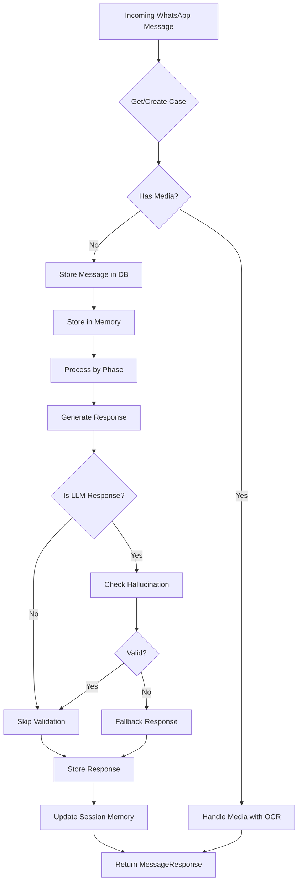

## Overview

The `ProcessIncomingMessageUseCase` is the core orchestrator for handling incoming WhatsApp messages in the divorce platform. It manages the entire conversation flow through a state machine pattern, coordinating validation, AI responses, memory management, and document processing.

**Source**: `backend/src/application/use_cases/process_incoming_message.py`

## Class Structure

### Main Class

```python
class ProcessIncomingMessageUseCase:
    """
    Caso de uso principal: Procesar mensaje entrante de WhatsApp
    Orquesta validación, memoria contextual, LLM y flujo de estados
    """
```

Defined at: `process_incoming_message.py:52-56`

### Dependencies

The use case initializes with the following dependencies:

```python
def __init__(self, db: Session):
    self.db = db
    self.cases = CaseRepository(db)
    self.messages = MessageRepository(db)
    self.llm = LLMRouter()
    self.memory = MemoryService(db, self.llm)
    self.hallucination = HallucinationDetectionService()
    self.validator_resp = SimpleResponseValidationService()
    self.validator_addr = SimpleAddressValidationService()
    self.validator_date = SimpleDateValidationService()
    self.ocr = MultiProviderOCRService()
    self.whatsapp = WAHAWhatsAppService()
    self.safety = SafetyLayer()
    self._pending_interactive: Dict[str, Any] = {}
```

Defined at: `process_incoming_message.py:58-72`

<Info>
The use case depends on **12 different services**, making it the central orchestrator for the entire application logic.
</Info>

## Data Transfer Objects (DTOs)

### IncomingMessageRequest

Input DTO for incoming WhatsApp messages:

```python
@dataclass
class IncomingMessageRequest:
    """DTO para mensaje entrante"""
    phone: str
    text: str
    media_id: Optional[str] = None
    mime_type: Optional[str] = None
```

Defined at: `process_incoming_message.py:19-25`

**Fields:**
- `phone`: User's phone number (E.164 format)
- `text`: Message text content
- `media_id`: Optional media attachment ID from WhatsApp
- `mime_type`: MIME type of attached media

### MessageResponse

Output DTO with response data and interactive elements:

```python
@dataclass
class MessageResponse:
    """
    DTO para respuesta del asistente.
    
    should_send indica si corresponde enviar la respuesta al usuario.
    
    Campos interactivos (opcionales):
    - buttons: Lista de botones de respuesta rápida [{"text": "Opción"}]. Máx 3.
    - list_data: Datos para mensaje tipo lista {"description", "button_text", "sections", "title", "footer"}.
    - header / footer: Texto de encabezado / pie para mensajes con botones.
    """
    text: str
    should_send: bool = True
    send_document: bool = False
    document_path: Optional[str] = None
    # --- Campos interactivos ---
    buttons: Optional[List[Dict[str, str]]] = None
    list_data: Optional[Dict[str, Any]] = None
    header: Optional[str] = None
    footer: Optional[str] = None
```

Defined at: `process_incoming_message.py:28-50`

<Note>
The response supports **WhatsApp interactive elements** like buttons and lists through the optional fields. The `text` field serves as both the message body and fallback if interactive features fail.
</Note>

## Main Execution Flow

### execute() Method

The main entry point that processes a message:

```python
async def execute(self, request: IncomingMessageRequest) -> MessageResponse:
    """Ejecuta el caso de uso"""
    phone = request.phone
    text = request.text
    media_id = request.media_id
    mime_type = request.mime_type
    
    # 1. Obtener o crear caso
    case = self.cases.get_or_create_by_phone(phone)
    
    logger.info("processing_message", case_id=case.id, phone=phone, 
                phase=case.phase, has_media=bool(media_id))
    
    # 2. Si hay media, procesar imagen (pasar caption/texto si lo hubiera)
    if media_id:
        return await self._handle_media(case, media_id, mime_type, text)
    
    # 3. Almacenar mensaje del usuario en DB y memoria
    self.messages.add_message(case.id, "user", text)
    await self.memory.store_immediate_memory(case.id, f"Usuario: {text}")
    
    # 4. Resetear estado interactivo pendiente
    self._pending_interactive = {}
    self._is_template_response = True
    
    # 5. Procesar según fase del caso (máquina de estados)
    reply = await self._handle_phase(case, text)
    
    # 6. Validar respuesta contra alucinaciones
    is_interactive = bool(self._pending_interactive)
    if not is_interactive and not self._is_template_response:
        context = await self.memory.build_context_for_llm(case.id, text)
        hallucination_check = await self.hallucination.check_response(
            reply, context, text
        )
        
        if not hallucination_check.is_valid:
            logger.warning(
                "hallucination_detected",
                case_id=case.id,
                confidence=hallucination_check.confidence,
                flags=hallucination_check.flags
            )
            reply = "Disculpá, tuve un problema. ¿Podés reformular tu consulta?"
            self._pending_interactive = {}
    
    # 7. Almacenar respuesta del asistente
    self.messages.add_message(case.id, "assistant", reply)
    await self.memory.store_immediate_memory(case.id, f"Asistente: {reply}")
    
    # 8. Guardar datos en memoria de sesión
    await self._update_session_memory(case)
    
    # 9. Construir respuesta con datos interactivos si existen
    return MessageResponse(
        text=reply,
        buttons=self._pending_interactive.get("buttons"),
        list_data=self._pending_interactive.get("list_data"),
        header=self._pending_interactive.get("header"),
        footer=self._pending_interactive.get("footer"),
    )
```

Defined at: `process_incoming_message.py:74-132`

## Processing Flow Diagram



## Phase Handling System

### State Machine Pattern

The use case implements a **finite state machine** where each case progresses through predefined phases:

```python
async def _handle_phase(self, case, text: str) -> str:
    """Maneja el flujo según la fase actual del caso"""
    
    if case.phase == "inicio":
        return await self._phase_inicio(case)
    
    elif case.phase == "tipo_divorcio":
        return await self._phase_tipo_divorcio(case, text)
    
    elif case.phase == "apellido":
        return await self._phase_apellido(case, text)
    
    elif case.phase == "nombres":
        return await self._phase_nombres(case, text)
    
    # ... 20+ additional phases
    
    else:
        # Fallback: usar LLM con contexto
        return await self._llm_fallback(case, text)
```

Defined at: `process_incoming_message.py:134-229`

<Warning>
The phase handler includes **26 different phases** for the divorce case workflow. Each phase validates specific data and transitions to the next appropriate phase.
</Warning>

### Available Phases

| Phase | Purpose | Next Phase |
|-------|---------|------------|
| `inicio` | Initial greeting | `tipo_divorcio` |
| `tipo_divorcio` | Select divorce type (unilateral/joint) | `apellido` |
| `apellido` | Collect last name | `nombres` |
| `nombres` | Collect first names | `cuit` |
| `cuit` | Collect CUIT/CUIL (extracts DNI) | `fecha_nacimiento` |
| `fecha_nacimiento` | Validate birth date | `domicilio` |
| `domicilio` | Validate address | `econ_intro` |
| `econ_intro` | Economic profile intro | `econ_situacion` |
| `econ_situacion` | Employment situation | `econ_ingreso` or `econ_vivienda` |
| `econ_ingreso` | Monthly income | `econ_vivienda` |
| `econ_vivienda` | Housing type | `econ_alquiler` or `econ_patrimonio_inmuebles` |
| ... | ... | ... |
| `documentacion` | Document upload phase | Final phase |

## Example Phase Implementation

### Phase: tipo_divorcio

```python
async def _phase_tipo_divorcio(self, case, text: str) -> str:
    """Fase: selección de tipo de divorcio"""
    low = text.lower()
    if "unilateral" in low or "solo" in low:
        case.type = "unilateral"
        case.phase = "apellido"
        self.cases.update(case)
        return "Perfecto, divorcio unilateral. Ahora necesito algunos datos personales.\n\n¿Cuál es tu apellido?"
    elif "conjunta" in low or "ambos" in low or "los dos" in low:
        case.type = "conjunta"
        case.phase = "apellido"
        self.cases.update(case)
        return "Perfecto, divorcio conjunta. Ahora necesito algunos datos personales.\n\n¿Cuál es tu apellido?"
    else:
        body = "Por favor, seleccioná cómo desean presentar el divorcio:"
        self._pending_interactive = {
            "buttons": [
                {"text": "Solo yo (Unilateral)"},
                {"text": "Los dos (Conjunta)"},
            ],
        }
        return body
```

Defined at: `process_incoming_message.py:249-270`

### Phase: cuit (with validation)

```python
async def _phase_cuit(self, case, text: str) -> str:
    """Fase: recolección de CUIT/CUIL y extracción de DNI"""
    import re
    
    # Limpiar el CUIT: quitar guiones y espacios
    cuit_clean = re.sub(r'[\s-]', '', text.strip())
    
    # Validar formato CUIT: 10 u 11 dígitos
    if not re.match(r'^\d{10,11}$', cuit_clean):
        return "El CUIT/CUIL ingresado no es válido. Debe tener 11 números (o 10 en algunos casos).\n\nPor favor, ingresalo nuevamente sin puntos ni espacios."
    
    # Extraer DNI del CUIT (dígitos 3 al 10)
    dni = cuit_clean[2:10]
    
    # Formatear CUIT con guiones para visualización
    cuit_formatted = f"{cuit_clean[0:2]}-{dni}-{cuit_clean[10]}"
    
    case.cuit = cuit_formatted
    case.dni = dni
    case.phase = "fecha_nacimiento"
    self.cases.update(case)
    
    return f"✅ CUIT/CUIL: {cuit_formatted}\nDNI extraído: {dni}\n\n¿Cuál es tu fecha de nacimiento? Formato: DD/MM/AAAA"
```

Defined at: `process_incoming_message.py:298-320`

## Interactive Elements

### Creating Buttons

```python
async def _phase_inicio(self, case) -> str:
    """Fase inicial: saludo y presentación"""
    case.phase = "tipo_divorcio"
    self.cases.update(case)
    body = (
        "¡Hola! 👋 Soy tu asistente de la *Defensoría Civil de San Rafael*.\n\n"
        "Te voy a guiar paso a paso para iniciar tu trámite de divorcio.\n\n"
        "¿Cómo desean presentarlo?"
    )
    self._pending_interactive = {
        "buttons": [
            {"text": "Solo yo (Unilateral)"},
            {"text": "Los dos (Conjunta)"},
        ],
        "footer": "Defensoría Civil - San Rafael",
    }
    return body
```

Defined at: `process_incoming_message.py:231-247`

### Creating Lists

```python
self._pending_interactive = {
    "list_data": {
        "description": body,
        "button_text": "Ver opciones",
        "title": "Situación Laboral",
        "footer": "Seleccioná la opción que corresponda",
        "sections": [{
            "title": "Opciones",
            "rows": [
                {"title": "Desocupado/a", "rowId": "desocupado", 
                 "description": "Sin empleo actual"},
                {"title": "Relación de dependencia", "rowId": "dependencia", 
                 "description": "Empleado/a en blanco"},
                {"title": "Autónomo / Monotributo", "rowId": "autonomo", 
                 "description": "Trabajo independiente"},
                # ... more options
            ],
        }],
    }
}
```

Defined at: `process_incoming_message.py:368-386`

## Hallucination Detection

### Validation Logic

For LLM-generated responses (not templates), the use case validates against hallucinations:

```python
# 6. Validar respuesta contra alucinaciones
#    Solo para respuestas generadas por LLM
is_interactive = bool(self._pending_interactive)
if not is_interactive and not self._is_template_response:
    context = await self.memory.build_context_for_llm(case.id, text)
    hallucination_check = await self.hallucination.check_response(
        reply, context, text
    )
    
    if not hallucination_check.is_valid:
        logger.warning(
            "hallucination_detected",
            case_id=case.id,
            confidence=hallucination_check.confidence,
            flags=hallucination_check.flags
        )
        reply = "Disculpá, tuve un problema. ¿Podés reformular tu consulta?"
        self._pending_interactive = {}
```

Defined at: `process_incoming_message.py:102-116`

<Info>
**Hallucination checking is skipped for:**
- Template responses (predefined text)
- Interactive messages (buttons/lists)

**It only runs for** free-form LLM responses from the fallback handler.
</Info>

## LLM Fallback Handler

### Usage

When a phase is not recognized or for general queries:

```python
async def _llm_fallback(self, case, text: str) -> str:
    """Fallback: usar LLM con contexto completo"""
    self._is_template_response = False
    context = await self.memory.build_context_for_llm(case.id, text)
    
    system_prompt = f"""Sos un asistente legal de la Defensoría Civil de San Rafael, Mendoza, Argentina.
Tu rol es ayudar con trámites de divorcio de forma cercana, clara y profesional.

IMPORTANTE: No incluyas datos personales sensibles (DNI, CUIT/CUIL, teléfonos,
mails, direcciones exactas) salvo que ya hayan sido expresamente provistos por el usuario
en esta misma conversación, y evitá repetirlos salvo que sea estrictamente necesario.

CONTEXTO DEL CASO:
{context}

REGLAS IMPORTANTES:
- Respondé en español argentino cercano y respetuoso (usá 'vos')
- Sé breve y claro (máximo 3-4 oraciones)
- Si no sabés algo, admitilo y sugerí consultar con un operador
- NO inventes datos específicos (fechas, números, nombres)
- No repreguntes información ya registrada
- Para temas sensibles (violencia, menores), sugerí consulta presencial

Usuario pregunta: {text}

Respuesta:"""
    
    response = await self.llm.chat([{"role": "system", "content": system_prompt}])
    
    # Aplicar filtros de salida (PII, contenido sensible, etc.)
    safety_result = self.safety.filter_output(response)
    return safety_result.text.strip()
```

Defined at: `process_incoming_message.py:866-897`

## Real Usage Example

### API Integration

```python
from fastapi import APIRouter, Depends
from sqlalchemy.orm import Session
from application.use_cases.process_incoming_message import (
    ProcessIncomingMessageUseCase,
    IncomingMessageRequest,
    MessageResponse
)

router = APIRouter()

@router.post("/webhook/whatsapp", response_model=MessageResponse)
async def whatsapp_webhook(
    message: IncomingMessageRequest,
    db: Session = Depends(get_db)
):
    """Process incoming WhatsApp message"""
    use_case = ProcessIncomingMessageUseCase(db)
    response = await use_case.execute(message)
    return response

# Example request:
# POST /webhook/whatsapp
# {
#   "phone": "+5492604123456",
#   "text": "Hola, quiero iniciar un divorcio",
#   "media_id": null,
#   "mime_type": null
# }

# Example response:
# {
#   "text": "¡Hola! 👋 Soy tu asistente...",
#   "should_send": true,
#   "send_document": false,
#   "document_path": null,
#   "buttons": [
#     {"text": "Solo yo (Unilateral)"},
#     {"text": "Los dos (Conjunta)"}
#   ],
#   "list_data": null,
#   "header": null,
#   "footer": "Defensoría Civil - San Rafael"
# }
```

## Key Features

<CardGroup cols={2}>
  <Card title="State Machine" icon="diagram-project">
    26 phases guiding users through the complete divorce intake process
  </Card>
  <Card title="Validation" icon="shield-check">
    Date, address, and format validation with user-friendly error messages
  </Card>
  <Card title="Memory System" icon="brain">
    Immediate, session, and episodic memory for context-aware conversations
  </Card>
  <Card title="Hallucination Detection" icon="magnifying-glass">
    Validates LLM responses against conversation context to prevent false information
  </Card>
  <Card title="Interactive UI" icon="hand-pointer">
    WhatsApp buttons and lists for guided user experience
  </Card>
  <Card title="Safety Layer" icon="user-shield">
    Filters PII and sensitive content in outputs
  </Card>
</CardGroup>

## Related Use Cases

- [Authenticate User](/api/use-cases/authenticate-user) - User authentication for dashboard access
- [Ingest Document](/api/use-cases/ingest-document) - Legal document ingestion and embeddings

## See Also

- [Memory Service](/api/services/memory-service) - Context management
- [Validation Services](/api/services/validation) - Input validation
- [LLM Router](/api/infrastructure/llm-router) - AI model orchestration