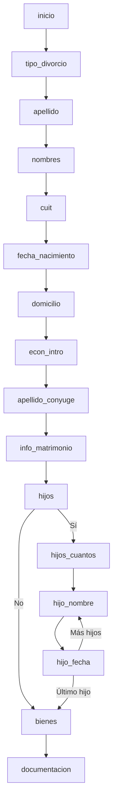

# State Machine

The Defensoría Civil platform uses a **finite state machine** to guide users through the divorce intake process in a structured, conversational way.

## Overview

Each case progresses through predefined phases, with validation and conditional branching:

```
inicio → tipo_divorcio → apellido → nombres → cuit → fecha_nacimiento → ...
```

The state machine ensures:
- **Sequential data collection** (one question at a time)
- **Validation** at each step
- **Conditional flows** (e.g., different paths for unilateral vs. conjunta)
- **Graceful error handling** (repeat questions on invalid input)

---

## Phase Storage

The current phase is stored in the `cases` table:

```python
# backend/src/infrastructure/persistence/models.py
class Case(Base):
    __tablename__ = "cases"
    id = Column(Integer, primary_key=True)
    phone = Column(String(32), index=True)
    phase = Column(String(32), default="inicio")  # Current phase
    type = Column(String(16))  # unilateral | conjunta
    status = Column(String(32), default="new")
    # ... collected data fields
```

---

## Phase Handler Architecture

**Location:** `backend/src/application/use_cases/process_incoming_message.py`

```python
class ProcessIncomingMessageUseCase:
    async def _handle_phase(self, case, text: str) -> str:
        """Routes to appropriate phase handler"""
        
        if case.phase == "inicio":
            return await self._phase_inicio(case)
        
        elif case.phase == "tipo_divorcio":
            return await self._phase_tipo_divorcio(case, text)
        
        elif case.phase == "apellido":
            return await self._phase_apellido(case, text)
        
        # ... more phases
        
        else:
            # Fallback to LLM for general questions
            return await self._llm_fallback(case, text)
```

---

## Complete Phase Flow

### Initial Phases

```
inicio
  ↓
tipo_divorcio (unilateral vs conjunta)
  ↓
apellido (last name)
  ↓
nombres (first names)
  ↓
cuit (CUIT/CUIL with DNI extraction)
  ↓
fecha_nacimiento (birth date with age validation)
  ↓
domicilio (address with jurisdiction validation)
```

### Economic Profile (BLSG Assessment)

```
econ_intro
  ↓
econ_situacion (employment situation)
  ↓
econ_ingreso (monthly income, if applicable)
  ↓
econ_vivienda (housing: propia/alquilada/cedida)
  ↓
econ_alquiler (rent amount, if applicable)
  ↓
econ_patrimonio_inmuebles (real estate)
  ↓
econ_patrimonio_registrables (vehicles, etc.)
  ↓
econ_cierre (calculate preliminary BLSG eligibility)
```

### Spouse Data

```
apellido_conyuge
  ↓
nombres_conyuge
  ↓
doc_conyuge (DNI or CUIT/CUIL)
  ↓
fecha_nacimiento_conyuge
  ↓
domicilio_conyuge
  ↓
info_matrimonio (date and place)
  ↓
ultimo_domicilio_conyugal (for jurisdiction)
```

### Children Information

```
hijos (yes/no)
  ↓
hijos_cuantos (how many)
  ↓
hijo_nombre (child 1 name)
  ↓
hijo_fecha (child 1 birth date)
  ↓
hijo_mayor_eval (if 18+: CUD? studying?)
  ↓
[repeat for each child]
  ↓
bienes (assets yes/no)
```

### Assets and Documentation

```
bienes (yes/no)
  ↓
bienes_detalle (if yes: describe assets)
  ↓
documentacion (document upload and general Q&A)
```

---

## Phase Implementations

### Phase: inicio

**First contact with the system.**

```python
async def _phase_inicio(self, case) -> str:
    """Initial phase: greeting and introduction"""
    case.phase = "tipo_divorcio"
    self.cases.update(case)
    
    body = (
        "¡Hola! 👋 Soy tu asistente de la *Defensoría Civil de San Rafael*.\n\n"
        "Te voy a guiar paso a paso para iniciar tu trámite de divorcio.\n\n"
        "¿Cómo desean presentarlo?"
    )
    
    # Interactive buttons
    self._pending_interactive = {
        "buttons": [
            {"text": "Solo yo (Unilateral)"},
            {"text": "Los dos (Conjunta)"},
        ],
        "footer": "Defensoría Civil - San Rafael",
    }
    
    return body
```

---

### Phase: tipo_divorcio

**Determine divorce type: unilateral or conjunta.**

```python
async def _phase_tipo_divorcio(self, case, text: str) -> str:
    """Phase: divorce type selection"""
    low = text.lower()
    
    if "unilateral" in low or "solo" in low:
        case.type = "unilateral"
        case.phase = "apellido"
        self.cases.update(case)
        return "Perfecto, divorcio unilateral. Ahora necesito algunos datos personales.\n\n¿Cuál es tu apellido?"
    
    elif "conjunta" in low or "ambos" in low or "los dos" in low:
        case.type = "conjunta"
        case.phase = "apellido"
        self.cases.update(case)
        return "Perfecto, divorcio conjunta. Ahora necesito algunos datos personales.\n\n¿Cuál es tu apellido?"
    
    else:
        # Invalid response: show buttons again
        body = "Por favor, seleccioná cómo desean presentar el divorcio:"
        self._pending_interactive = {
            "buttons": [
                {"text": "Solo yo (Unilateral)"},
                {"text": "Los dos (Conjunta)"},
            ],
        }
        return body
```

---

### Phase: apellido

**Collect last name.**

```python
async def _phase_apellido(self, case, text: str) -> str:
    """Phase: last name collection"""
    apellido = text.strip().upper()  # Last name in uppercase
    
    if len(apellido) < 2:
        return "Por favor, indicá tu apellido."
    
    case.apellido = apellido
    case.phase = "nombres"
    self.cases.update(case)
    
    return "¿Cuáles son tus nombres? (sin apellido)"
```

---

### Phase: cuit

**Collect CUIT/CUIL and extract DNI.**

```python
async def _phase_cuit(self, case, text: str) -> str:
    """Phase: CUIT/CUIL collection with DNI extraction"""
    import re
    
    # Clean: remove dashes and spaces
    cuit_clean = re.sub(r'[\s-]', '', text.strip())
    
    # Validate: 10 or 11 digits
    if not re.match(r'^\d{10,11}$', cuit_clean):
        return (
            "El CUIT/CUIL ingresado no es válido. "
            "Debe tener 11 números (o 10 en algunos casos).\n\n"
            "Por favor, ingresalo nuevamente sin puntos ni espacios."
        )
    
    # Extract DNI (digits 3-10)
    dni = cuit_clean[2:10]
    
    # Format with dashes
    cuit_formatted = f"{cuit_clean[0:2]}-{dni}-{cuit_clean[10]}"
    
    case.cuit = cuit_formatted
    case.dni = dni
    case.phase = "fecha_nacimiento"
    self.cases.update(case)
    
    return (
        f"✅ CUIT/CUIL: {cuit_formatted}\n"
        f"DNI extraído: {dni}\n\n"
        "¿Cuál es tu fecha de nacimiento? Formato: DD/MM/AAAA"
    )
```

---

### Phase: fecha_nacimiento

**Validate birth date (must be 18+).**

```python
async def _phase_fecha_nacimiento(self, case, text: str) -> str:
    """Phase: birth date validation"""
    result = self.validator_date.validate_birth_date(text)
    
    if not result.is_valid:
        errors = "\n- ".join(result.errors)
        return (
            f"La fecha no es válida:\n- {errors}\n\n"
            "Ingresá tu fecha de nacimiento en formato DD/MM/AAAA."
        )
    
    # Store normalized date
    from datetime import datetime
    try:
        case.fecha_nacimiento = datetime.strptime(
            result.normalized_date, 
            "%d/%m/%Y"
        ).date()
    except:
        pass
    
    case.phase = "domicilio"
    self.cases.update(case)
    
    return (
        "✅ Perfecto. ¿Cuál es tu domicilio actual?\n\n"
        "Ejemplo: San Martín 123, San Rafael, Mendoza"
    )
```

**Validation logic** (`backend/src/infrastructure/validation/date_validation_service_impl.py`):

```python
class SimpleDateValidationService(DateValidationService):
    def validate_birth_date(self, date_str: str) -> DateValidationResult:
        d = parse_date(date_str)  # Parse DD/MM/YYYY
        errors = []
        
        if not d:
            errors.append("Formato de fecha inválido. Use DD/MM/AAAA.")
            return DateValidationResult(False, errors)
        
        today = date.today()
        
        if d > today:
            errors.append("La fecha no puede ser futura.")
        
        if d.year < 1900:
            errors.append("La fecha es demasiado antigua.")
        
        age = years_between(d, today)
        if age < 18:
            errors.append("Debe ser mayor de 18 años.")
        
        return DateValidationResult(
            len(errors) == 0, 
            errors, 
            normalized_date=d.strftime("%d/%m/%Y"),
            age_years=age
        )
```

---

### Phase: domicilio

**Validate address format and jurisdiction.**

```python
async def _phase_domicilio(self, case, text: str) -> str:
    """Phase: address validation"""
    result = self.validator_addr.validate_address(text, is_marital_address=False)
    
    if not result.is_valid:
        errors = "\n- ".join(result.errors)
        return (
            "La dirección está incompleta:\n- " + errors +
            "\n\nPodés responder de estas formas:\n"
            "- Calle y número (ej: 'San Martín 123')\n"
            "- Ciudad y provincia (ej: 'San Rafael Mendoza' o 'San Rafael, Mendoza')\n"
            "- O todo junto: 'San Martín 123, San Rafael Mendoza'"
        )
    
    case.domicilio = result.normalized_address or text.strip()
    case.phase = "econ_intro"  # Move to economic profile
    case.status = "datos_personales_completos"
    self.cases.update(case)
    
    # Generate episodic memory summary
    summary = f"Usuario {case.nombre} completó datos personales para divorcio {case.type}."
    await self.memory.store_episodic_memory(case.id, summary)
    
    # Continue to economic profile...
    return "Antes de seguir, vamos a registrar algunos datos económicos..."
```

---

### Phase: hijos

**Ask about children.**

```python
async def _phase_hijos(self, case, text: str) -> str:
    """Phase: children information"""
    low = text.lower().strip()
    
    if low in ['no', 'no tenemos', 'ninguno', 'no hay']:
        case.tiene_hijos = False
        case.phase = "bienes"
        self.cases.update(case)
        
        body = (
            "Entendido. No van a incluir hijos en el convenio.\n\n"
            "¿Tienen bienes en común? (casa, auto, cuentas bancarias, etc.)"
        )
        self._pending_interactive = {
            "buttons": [{"text": "Sí"}, {"text": "No"}],
        }
        return body
    
    # If yes, ask how many
    case.tiene_hijos = True
    case.phase = "hijos_cuantos"
    self.cases.update(case)
    
    return (
        "Perfecto. Solo incluiremos hijos con las características indicadas.\n\n"
        "¿Cuántos hijos en común con esas características desean declarar?"
    )
```

---

### Phase: hijo_fecha

**Validate child's birth date and determine inclusion criteria.**

```python
async def _phase_hijo_fecha(self, case, text: str) -> str:
    from datetime import datetime, date
    import re
    
    # Parse date
    m = re.search(r"\b(\d{1,2})[/-](\d{1,2})[/-](\d{4})\b", text)
    if not m:
        return "Ingresá la fecha en formato DD/MM/AAAA."
    
    try:
        dob = datetime.strptime(f"{m.group(1)}/{m.group(2)}/{m.group(3)}", "%d/%m/%Y").date()
    except:
        return "La fecha no es válida. Usá el formato DD/MM/AAAA."
    
    # Calculate age
    today = date.today()
    age = today.year - dob.year - ((today.month, today.day) < (dob.month, dob.day))
    
    # Get child name and counters from session memory
    data = await self.memory.retrieve_session_data(case.id)
    nombre_hijo = data.get("hijo_actual_nombre", "Hijo")
    total = int(data.get("hijos_total", 1) or 1)
    index = int(data.get("hijos_index", 0) or 0)
    
    # Determine inclusion
    if age < 18:
        motivo = "MENOR_18"
        incluido = True
    else:
        # Requires additional evaluation (CUD? studying?)
        await self.memory.store_session_memory(case.id, "hijo_actual_edad", age)
        case.phase = "hijo_mayor_eval"
        self.cases.update(case)
        
        body = f"{nombre_hijo} tiene {age} años. ¿En cuál situación se encuentra?"
        self._pending_interactive = {
            "buttons": [
                {"text": "Tiene CUD vigente"},
                {"text": "Estudia (18-25)"},
                {"text": "Ninguna aplica"},
            ],
        }
        return body
    
    # Register child and continue
    linea = f"{nombre_hijo} - Fecha nac.: {dob.strftime('%d/%m/%Y')} - Motivo: {motivo}"
    case.info_hijos = (case.info_hijos + "\n" if case.info_hijos else "") + linea
    
    index += 1
    await self.memory.store_session_memory(case.id, "hijos_index", index)
    self.cases.update(case)
    
    if index >= total:
        case.phase = "bienes"
        return "✅ Datos de hijos registrados.\n\n¿Tienen bienes en común?"
    else:
        case.phase = "hijo_nombre"
        return f"Decime el nombre completo del hijo/a {index+1}"
```

---

### Phase: documentacion

**Final phase: document upload and general Q&A.**

```python
async def _phase_documentacion(self, case, text: str) -> str:
    """Phase: documentation and general questions"""
    low = text.lower().strip()
    
    # User confirms document upload
    if low in ["listo", "listo!", "ya envié"]:
        return await self._build_docs_status_message(case)
    
    # User asks about documentation
    if any(k in low for k in ["document", "papeles", "enviar", "foto"]):
        parts = [
            "Podés enviar la documentación por este chat (WhatsApp).",
            "Mandá fotos nítidas donde se lean todos los datos:",
        ]
        if not case.dni_image_url:
            parts.append("- DNI del solicitante (frente y dorso)")
        if not case.marriage_cert_url:
            parts.append("- Acta de matrimonio actualizada")
        
        return "\n".join(parts)
    
    # Fallback to LLM for other questions
    return await self._llm_fallback(case, text)
```

---

## State Transitions

### Linear Transitions

Most phases follow a linear path:

```python
case.phase = "next_phase"
self.cases.update(case)
```

### Conditional Branching

Some phases branch based on user input:

```python
if case.type == "unilateral":
    case.phase = "bienes"
else:
    case.phase = "spouse_data"
```

### Looping (Children)

The children flow loops:

```python
index += 1
if index >= total:
    case.phase = "bienes"  # Exit loop
else:
    case.phase = "hijo_nombre"  # Next child
```

---

## Interactive Elements

Phases can include interactive buttons or lists:

```python
# Buttons (max 3)
self._pending_interactive = {
    "buttons": [
        {"text": "Sí"},
        {"text": "No"},
    ],
    "footer": "Defensoría Civil",
}

# List picker
self._pending_interactive = {
    "list_data": {
        "description": "Seleccioná tu situación laboral",
        "button_text": "Ver opciones",
        "title": "Situación Laboral",
        "sections": [{
            "title": "Opciones",
            "rows": [
                {"title": "Desocupado/a", "rowId": "desocupado"},
                {"title": "Relación de dependencia", "rowId": "dependencia"},
            ],
        }],
    }
}
```

---

## Error Handling

Invalid input doesn't advance the phase:

```python
if not result.is_valid:
    # Show error message
    errors = "\n- ".join(result.errors)
    return f"La fecha no es válida:\n- {errors}\n\nIntentá nuevamente."
    # Phase remains unchanged
```

---

## Fallback to LLM

If user asks a question outside the current phase:

```python
async def _llm_fallback(self, case, text: str) -> str:
    """Fallback: use LLM with full context"""
    self._is_template_response = False  # Flag for hallucination check
    
    context = await self.memory.build_context_for_llm(case.id, text)
    
    system_prompt = f"""Sos un asistente legal de la Defensoría Civil.
    
CONTEXTO DEL CASO:
{context}

Usuario pregunta: {text}

Responde de forma breve y clara."""
    
    response = await self.llm.chat([{"role": "system", "content": system_prompt}])
    
    # Apply safety filters
    safety_result = self.safety.filter_output(response)
    return safety_result.text.strip()
```

---

## Visualization



---

## Key Takeaways

1. **Finite state machine** guides users through structured intake
2. **Phase handlers** validate input and advance state
3. **Conditional branching** based on divorce type, children, etc.
4. **Interactive elements** (buttons, lists) improve UX
5. **Error handling** keeps users in current phase until valid input
6. **LLM fallback** handles off-script questions
7. **Memory integration** stores progress at each phase

---

## Related Pages

- [Clean Architecture](/concepts/clean-architecture) - System architecture overview
- [Memory System](/concepts/memory-system) - Contextual memory with vector search
- [Validation](/concepts/validation) - Input validation at each phase
