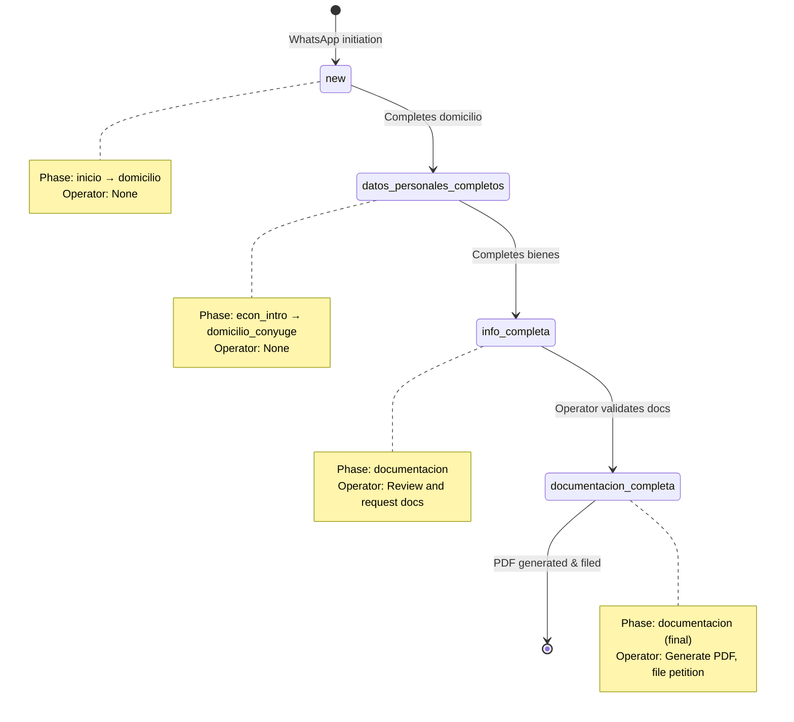

## Overview

A divorce case in the Defensoría Civil platform progresses through a **state machine** with defined phases and status levels. Cases are created automatically when a citizen initiates a WhatsApp conversation and advance through data collection, document submission, operator review, and finally PDF generation.

---

## Case States

### Status Levels

The `status` field tracks the overall completion level:

<AccordionGroup>
  <Accordion title="new" icon="circle" iconType="solid">
    **Initial state** when case is created.

    **Characteristics:**
    - User has sent first WhatsApp message
    - Basic information collection in progress
    - No personal data yet

    **Phase:** Usually `inicio` or `tipo_divorcio`

    **Operator action:** None yet - bot is handling data collection
  </Accordion>

  <Accordion title="datos_personales_completos" icon="user-check" iconType="solid">
    **Personal data collected** but economic profile or spouse data incomplete.

    **Characteristics:**
    - Applicant's name, DNI, CUIT, birth date, and address stored
    - Economic profile collection in progress or complete
    - Spouse information may be incomplete

    **Phase range:** `econ_intro` through `domicilio_conyuge`

    **Transition trigger:** Set when `case.domicilio` is completed

    **Database field:** `case.status = "datos_personales_completos"`
  </Accordion>

  <Accordion title="info_completa" icon="clipboard-check" iconType="solid">
    **All information collected** including spouse, children, and assets.

    **Characteristics:**
    - Complete personal data for both parties
    - Marriage information (date, location, last marital address)
    - Children information (if applicable)
    - Assets information (if applicable)
    - Economic profile complete

    **Phase:** `documentacion`

    **Transition trigger:** Set when assets phase completes

    **Operator action:** Case appears in "ready for review" queue
  </Accordion>

  <Accordion title="documentacion_completa" icon="file-check" iconType="solid">
    **All required documents uploaded and validated.**

    **Characteristics:**
    - DNI images (front and back) uploaded
    - Marriage certificate uploaded
    - Economic support documents uploaded (based on employment status)
    - OCR processing complete
    - Operator has validated documents

    **Transition:** Manual - operator marks as complete

    **Next step:** PDF generation and legal review
  </Accordion>
</AccordionGroup>

---

### Phase State Machine

The `phase` field tracks the specific conversation step. Each phase corresponds to a data collection point.

#### Complete Phase Sequence

```mermaid
flowchart TD
    A[inicio] --> B[tipo_divorcio]
    B --> C[apellido]
    C --> D[nombres]
    D --> E[cuit]
    E --> F[fecha_nacimiento]
    F --> G[domicilio]
    G --> H[econ_intro]
    H --> I[econ_situacion]
    I --> J{Employed?}
    J -->|Yes| K[econ_ingreso]
    J -->|No| L[econ_vivienda]
    K --> L
    L --> M{Rented?}
    M -->|Yes| N[econ_alquiler]
    M -->|No| O[econ_patrimonio_inmuebles]
    N --> O
    O --> P[econ_patrimonio_registrables]
    P --> Q[econ_cierre]
    Q --> R[apellido_conyuge]
    R --> S[nombres_conyuge]
    S --> T[doc_conyuge]
    T --> U[fecha_nacimiento_conyuge]
    U --> V[domicilio_conyuge]
    V --> W[info_matrimonio]
    W --> X[ultimo_domicilio_conyugal]
    X --> Y[hijos]
    Y --> Z{Has children?}
    Z -->|No| AA[bienes]
    Z -->|Yes| AB[hijos_cuantos]
    AB --> AC[hijo_nombre]
    AC --> AD[hijo_fecha]
    AD --> AE{Age >= 18?}
    AE -->|No| AF{More children?}
    AE -->|Yes| AG[hijo_mayor_eval]
    AG --> AF
    AF -->|Yes| AC
    AF -->|No| AA
    AA --> AH{Has assets?}
    AH -->|Yes| AI[bienes_detalle]
    AH -->|No| AJ[documentacion]
    AI --> AJ
```



#### Phase Definitions

<CodeGroup>
```python Applicant Personal Data
"inicio"                    # Initial greeting
"tipo_divorcio"             # Divorce type selection
"apellido"                  # Last name
"nombres"                   # First/middle names
"cuit"                      # CUIT/CUIL (DNI extracted)
"fecha_nacimiento"          # Birth date
"domicilio"                 # Current address
```

```python Economic Profile (BLSG)
"econ_intro"                # Introduction to economic declaration
"econ_situacion"            # Employment status
"econ_ingreso"              # Monthly income (conditional)
"econ_vivienda"             # Housing type
"econ_alquiler"             # Rent amount (conditional)
"econ_patrimonio_inmuebles" # Real estate owned
"econ_patrimonio_registrables" # Vehicles and registered assets
"econ_cierre"               # Economic profile completion
```

```python Spouse Information
"apellido_conyuge"          # Spouse last name
"nombres_conyuge"           # Spouse first/middle names
"doc_conyuge"               # Spouse DNI/CUIT
"fecha_nacimiento_conyuge"  # Spouse birth date
"domicilio_conyuge"         # Spouse current address
```

```python Marriage & Family
"info_matrimonio"           # Marriage date and location
"ultimo_domicilio_conyugal" # Last marital address (competency)
"hijos"                     # Children yes/no
"hijos_cuantos"             # Number of children
"hijo_nombre"               # Child name (iterative)
"hijo_fecha"                # Child birth date (iterative)
"hijo_mayor_eval"           # Adult child evaluation (conditional)
"bienes"                    # Assets yes/no
"bienes_detalle"            # Assets description (conditional)
```

```python Final Phase
"documentacion"             # Document upload and general queries
```
</CodeGroup>

---

## Document Submission Flow

### Required Documents

<CardGroup cols={2}>
  <Card title="DNI (Applicant)" icon="id-card">
    **Front and back images**

    - Clear, legible photos
    - All fields visible
    - No glare or shadows

    **Storage:**
    - `case.dni_image_url` (front)
    - `case.dni_back_url` (back)

    **OCR Extraction:**
    - Name verification
    - DNI number validation
    - Birth date verification
  </Card>

  <Card title="Marriage Certificate" icon="file-certificate">
    **Updated certificate** ("acta actualizada")

    **Required data:**
    - Certificate number
    - Book and folio
    - Year
    - Issuing office
    - Marriage date and location

    **Storage:** `case.marriage_cert_url`

    **OCR Extraction:**
    ```python
    case.acta_numero
    case.acta_libro
    case.acta_foja
    case.acta_anio
    case.acta_oficina
    ```
  </Card>

  <Card title="Employment Documentation" icon="briefcase">
    **Varies by employment status:**

    - **Dependencia:** Latest pay stub
    - **Autónomo/Monotributo:** AFIP tax position certificate
    - **Desocupado:** ANSES negative certificate
    - **Jubilado:** Latest pension receipt

    **Storage:** `SupportDocument` table

    **Types:**
    - `recibo_sueldo`
    - `afip_constancia`
    - `anses_cert`
    - `jubilacion_comprobante`
  </Card>

  <Card title="Additional Documents" icon="folder-plus">
    **May be requested by operator:**

    - Property deeds
    - Vehicle registration
    - Bank statements
    - Disability certificates (CUD)
    - Student enrollment proof

    **Storage:** `SupportDocument` with `doc_type: "otro"`
  </Card>
</CardGroup>

### Upload Process

<Steps>
  <Step title="User sends media via WhatsApp">
    **WhatsApp message includes:**
    - `media_id`: Unique identifier from WhatsApp
    - `mime_type`: Image format (image/jpeg, image/png, application/pdf)
    - Optional caption text

    **Webhook receives:** `IncomingMessageRequest` with `media_id`
  </Step>

  <Step title="Media handling in ProcessIncomingMessageUseCase">
    **Code path:** `_handle_media()` method

    ```python
    if media_id:
        return await self._handle_media(case, media_id, mime_type, text)
    ```

    **Document type detection:**
    - If `case.phase == "documentacion"` → Checks what's missing
    - Uses `mime_type` to validate file type
    - Caption text used for context hints
  </Step>

  <Step title="OCR Processing">
    **Service:** `MultiProviderOCRService`

    **Providers (fallback chain):**
    1. OpenAI GPT-4 Vision
    2. Anthropic Claude Vision
    3. Google Document AI (future)

    **Extraction:**
    ```python
    ocr_result = await self.ocr.extract_from_document(
        image_url=media_url,
        document_type="dni_front"  # or "dni_back", "marriage_cert"
    )
    ```

    **Validation:**
    - Cross-checks extracted DNI against user-provided DNI
    - Validates date formats
    - Checks for required fields
  </Step>

  <Step title="Storage and confirmation">
    **Database updates:**
    - Main document fields: `case.dni_image_url`, `case.marriage_cert_url`
    - Supporting docs: New row in `support_documents` table
    - OCR results: Stored in `ocr_summary` field

    **User confirmation:**
    ```
    ✅ DNI (frente) recibido.

    Queda pendiente:
    - DNI (dorso)
    - Acta de matrimonio actualizada
    - Recibo de sueldo
    ```
  </Step>
</Steps>

### Document Status Tracking

**Helper method:** `_build_docs_status_message()`

**Logic:**
1. Check which documents are uploaded (`dni_image_url`, `dni_back_url`, `marriage_cert_url`)
2. Query `support_documents` table for economic docs
3. Compare against expected docs based on `situacion_laboral`
4. Generate pending list

**Example output:**
```
Queda pendiente:
- Dorso del DNI
- Acta de matrimonio actualizada
- Recibo de sueldo
```

**Completion message:**
```
¡Perfecto! Ya recibimos toda la documentación.
Un operador la va a revisar y te avisamos al finalizar.
```

---

## Operator Review Process

### Dashboard Views

#### Cases List

**Route:** `/cases`

**Features:**
- Searchable by name or DNI
- Filterable by status: `new`, `datos_completos`, `documentacion_completa`
- Filterable by type: `unilateral`, `conjunta`
- Pagination (50 cases per page)
- Quick actions: View detail, Download PDF

**Component:** `frontend/src/features/cases/components/CasesList.tsx`

**Key fields displayed:**
| Column | Data |
|--------|------|
| ID | `case.id` |
| Nombre | `case.nombre` |
| DNI | `case.dni` |
| Tipo | `case.type` (unilateral/conjunta) |
| Estado | `case.status` with color badges |
| Fase | `case.phase` (formatted) |
| Fecha Creación | `case.created_at` |

#### Case Detail View

**Route:** `/cases/:id`

**Sections:**

<Tabs>
  <Tab title="Personal Information">
    **Applicant data:**
    - Full name (`apellido` + `nombres`)
    - DNI and CUIT
    - Birth date
    - Current address
    - Phone/WhatsApp (formatted with copy button)

    **Spouse data:**
    - Full name
    - DNI/CUIT
    - Birth date
    - Current address
  </Tab>

  <Tab title="Marriage Data">
    - Marriage date
    - Marriage location
    - Marriage certificate details (número, libro, foja, año, oficina)
    - **Last marital address** (competency indicator)
    - Jurisdiction warning if outside San Rafael
  </Tab>

  <Tab title="Economic Profile">
    **Applicant economic data:**
    - Employment status
    - Monthly net income
    - Housing type
    - Monthly rent (if applicable)
    - Real estate owned
    - Registered assets (vehicles)
    - **BLSG preliminary eligibility** (boolean + reasoning)

    **Spouse economic data** (conjunta only):
    - Same fields as above
    - Separate BLSG evaluation

    **Bot report:**
    - Combined analysis
    - Eligibility criteria breakdown
    - Document checklist
  </Tab>

  <Tab title="Documents Viewer">
    **Image preview component:**
    - DNI front
    - DNI back
    - Marriage certificate
    - Support documents (collapsible list)

    **Features:**
    - Inline image display
    - Download original
    - OCR extracted text display
    - Document type labels
  </Tab>

  <Tab title="Conversation History">
    **Message timeline:**
    - User messages (blue, right-aligned)
    - Assistant messages (gray, left-aligned)
    - Timestamps
    - Full conversation from `inicio` to current phase

    **Use case:** Understanding user context and responses
  </Tab>
</Tabs>

### Operator Actions

<AccordionGroup>
  <Accordion title="Contact User via WhatsApp" icon="message">
    **Two methods:**

    **1. Direct WhatsApp Link**
    - Button: "Contactar por WhatsApp"
    - Opens `wa.me/{phone}` with pre-filled message:
      ```
      Hola {nombre},

      Soy del equipo de la Defensoría Civil de San Rafael.

      Me comunico respecto a tu trámite de divorcio (Caso #{id}).

      ¿En qué puedo ayudarte?
      ```
    - Handles phone number normalization (Argentina: +549 prefix)
    - Warning for WhatsApp LID (internal IDs)

    **2. In-System Message**
    - Textarea for custom message
    - Button: "Enviar"
    - API: `POST /api/cases/{id}/operator-message`
    - Sends via WAHA WhatsApp service
    - Message delivered through bot's WhatsApp number
  </Accordion>

  <Accordion title="Request Additional Documentation" icon="file-arrow-up">
    **Modal:** `DocRequestModal`

    **Pre-defined request types:**
    - Missing DNI (back)
    - Marriage certificate
    - Income proof
    - Property documents
    - Custom request

    **Process:**
    1. Operator selects request type
    2. Optional custom message
    3. System sends WhatsApp message to user
    4. Updates case notes
  </Accordion>

  <Accordion title="Review Economic Profile" icon="chart-line">
    **Preliminary BLSG Evaluation:**

    **Calculated by bot:**
    ```python
    smvm = 250000  # Salario Mínimo Vital y Móvil
    per_capita = (ingreso - alquiler) / cargas_familia
    
    elegible = (
        per_capita <= 1.5 * smvm or
        ingreso <= 2.0 * smvm or
        vivienda_tipo == "cedida" or
        situacion_laboral == "desocupado"
    )
    ```

    **Operator review:**
    - Verify income documentation
    - Check asset declarations
    - Cross-reference with ANSES/AFIP data (manual)
    - Final BLSG approval/rejection (external to platform)

    **Display:** `EconomicProfileCard` component with visual indicators
  </Accordion>

  <Accordion title="Validate Documents" icon="circle-check">
    **Document validation checklist:**

    ✅ DNI legible and matches declared data
    ✅ Marriage certificate is updated ("actualizada")
    ✅ Income proof matches declared amount
    ✅ All required support documents present

    **OCR review:**
    - View extracted text from `ocr_summary`
    - Compare against user-provided data
    - Flag discrepancies

    **Action:** Manually update `case.status = "documentacion_completa"`
  </Accordion>

  <Accordion title="Mark Case Complete" icon="flag-checkered">
    **Status update:** API call to update status

    **Endpoint:** `PATCH /api/cases/{id}`
    ```json
    {
      "status": "documentacion_completa"
    }
    ```

    **Effect:**
    - Case appears in "Completados" filter
    - Enables PDF generation
    - Triggers notification to user (optional)
  </Accordion>
</AccordionGroup>

---

## PDF Generation

### Petition Document Types

<CardGroup cols={2}>
  <Card title="Unilateral Divorce" icon="user">
    **Template:** `DemandaDivorcioUnilateral`

    **Structure:**
    - **Heading:** Court, case type
    - **Applicant identification:** Name, DNI, CUIT, address
    - **Spouse identification:** Name, DNI, address
    - **Marriage data:** Date, location, certificate reference
    - **Jurisdiction:** Last marital address
    - **Children:** List if applicable (with inclusion criteria)
    - **Assets:** Description if applicable
    - **Legal grounds:** Article citations (CCyCN)
    - **Petition:** Formal request for divorce decree
    - **Signature block:** Space for applicant and attorney
  </Card>

  <Card title="Joint Divorce (Conjunta)" icon="users">
    **Template:** `DemandaDivorcioConjunta`

    **Additional sections:**
    - Both parties as co-petitioners
    - Mutual agreement statement
    - Joint custody proposal (if children)
    - Asset division agreement
    - Both signatures required
  </Card>
</CardGroup>

### Generation Process

<Steps>
  <Step title="User initiates PDF download">
    **Two entry points:**
    1. "Descargar PDF" button in case detail
    2. Download icon in cases list

    **Opens modal:** `PdfGenerationModal`

    **Options:**
    - Document type selection (if applicable)
    - Include/exclude optional sections
    - Preview before download
  </Step>

  <Step title="API request to backend">
    **Endpoint:** `GET /api/cases/{id}/petition/pdf`

    **Query parameters:**
    - `format`: `pdf` or `docx`
    - `include_children`: boolean
    - `include_assets`: boolean

    **Authentication:** Requires operator JWT token
  </Step>

  <Step title="Template rendering">
    **Service:** `DocumentGenerationService`

    **Process:**
    1. Fetch complete case data from database
    2. Validate required fields present
    3. Select appropriate template
    4. Populate template variables:
       ```python
       context = {
           "solicitante": {
               "nombre_completo": f"{case.apellido}, {case.nombres}",
               "dni": case.dni,
               "cuit": case.cuit,
               "domicilio": case.domicilio,
               "fecha_nacimiento": format_date(case.fecha_nacimiento)
           },
           "conyuge": { ... },
           "matrimonio": { ... },
           "hijos": parse_hijos(case.info_hijos),
           "bienes": case.info_bienes
       }
       ```
    5. Render template with context
  </Step>

  <Step title="PDF compilation">
    **Library:** ReportLab (Python) or similar

    **Formatting:**
    - Official court document styling
    - Legal formatting standards
    - Page numbers
    - Header/footer with case ID

    **Output:** Binary PDF stream
  </Step>

  <Step title="Download delivery">
    **Response headers:**
    ```
    Content-Type: application/pdf
    Content-Disposition: attachment; filename="demanda-divorcio-{case_id}.pdf"
    ```

    **Frontend handling:**
    ```typescript
    const blob = await casesApi.downloadPetition(caseId);
    const url = window.URL.createObjectURL(blob);
    const a = document.createElement('a');
    a.href = url;
    a.download = `demanda-divorcio-${caseId}.pdf`;
    a.click();
    ```
  </Step>
</Steps>

### Document Validation Before Generation

**Required fields check:**
```python
required_fields = [
    "nombre", "dni", "cuit", "fecha_nacimiento", "domicilio",
    "nombre_conyuge", "dni_conyuge", "domicilio_conyuge",
    "fecha_matrimonio", "lugar_matrimonio",
    "ultimo_domicilio_conyugal"
]

for field in required_fields:
    if not getattr(case, field):
        raise ValueError(f"Missing required field: {field}")
```

**Warning if missing:**
```
No se puede generar el PDF. Faltan los siguientes campos:
- Fecha de matrimonio
- Domicilio del cónyuge
```

---

## Case State Transitions Summary



---

## Technical Implementation

**Source files:**
- `backend/src/infrastructure/persistence/models.py`: Case model (lines 7-93)
- `backend/src/application/use_cases/process_incoming_message.py`: State machine logic
- `backend/src/infrastructure/persistence/repositories.py`: CaseRepository
- `frontend/src/features/cases/components/CaseDetail.tsx`: Operator UI
- `frontend/src/features/cases/components/CasesList.tsx`: Cases list UI

**Database schema:**
```sql
CREATE TABLE cases (
    id SERIAL PRIMARY KEY,
    phone VARCHAR(32) NOT NULL,
    status VARCHAR(32) DEFAULT 'new',
    type VARCHAR(16),  -- unilateral | conjunta
    phase VARCHAR(32) DEFAULT 'inicio',
    created_at TIMESTAMP,
    updated_at TIMESTAMP,
    -- 90+ more fields for collected data
);

CREATE TABLE support_documents (
    id SERIAL PRIMARY KEY,
    case_id INTEGER REFERENCES cases(id),
    doc_type VARCHAR(64) NOT NULL,
    media_id VARCHAR(255) NOT NULL,
    ocr_summary TEXT,
    created_at TIMESTAMP
);
```